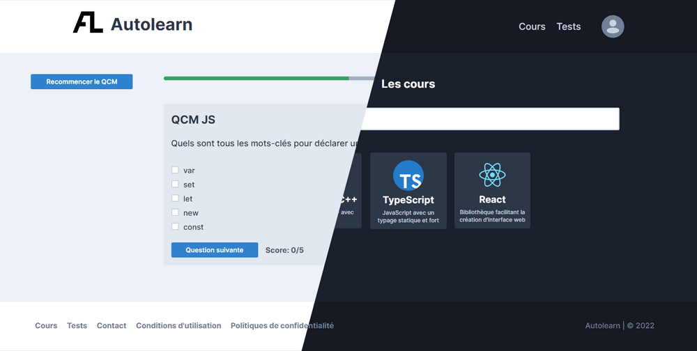

<div id="top"></div>

<!-- PROJECT LOGO -->
<br />
<div align="center">
  <h3 align="center">Auto Learn</h3>
  <p align="center">
    <a href="#">View Demo (TODO)</a>
  </p>
</div>

<!-- TABLE OF CONTENTS -->
<details>
  <summary>Table of Contents</summary>
  <ol>
    <li><a href="#about-the-project">About The Project</a></li>
    <li><a href="#context">Context</a></li>
    <li><a href="#built-with">Built With</a></li>
    <li><a href="#documentation">Documentation</a></li>
    <li><a href="#getting-started">Getting Started</a></li>
    <li><a href="#license">License</a></li>
    <li><a href="#contributors">Contributors</a></li>
  </ol>
</details>

<!-- ABOUT THE PROJECT -->
## About The Project

<div align="center">
  
</div>
<br />

This project is called **Auto Learn**, the basic principle is simple: an online platform for learning with courses and testing with quizzes.

There are two categories of users:

- The **learner**: he can take quizzes to test his knowledge on a particular subject. Courses are suggested to him based on the results he has obtained in the tests.
- The **admin**: he can manage users, courses and tests on the platform.

The courses suggested can be either one or more videos, or they can be written.

<p align="right">(<a href="#top">back to top</a>)</p>

<!-- CONTEXT -->
## Context

This project is an academic project realized during the **third year** of a **Bachelor** of Computer Science.
The development was done in a team of 6 people.

<p align="right">(<a href="#top">back to top</a>)</p>

## Built With

Entire project was built with vanilla PHP and basic [MVC](https://en.wikipedia.org/wiki/Model%E2%80%93view%E2%80%93controller) architectural pattern. Database used is MySQL.

<p align="right">(<a href="#top">back to top</a>)</p>

<!-- DOCUMENTATION -->
## Documentation

You can find documentation such as the requirements analysis, and UML diagrams in the file `docs/rapport.pdf`.

<!-- GETTING STARTED -->
## Getting Started

To get a local copy up and running follow the steps:

### Prerequisites

To setup the project, you will need:
* [PHP 7.0.0+](https://www.php.net/downloads)
* [MySQL 5.7+](https://www.mysql.com/downloads/)
* [Apache Server](https://httpd.apache.org/download.cgi)

### Installation

1. Clone the repo:
   ```sh
   git clone https://github.com/Akwd22/auto-learn.git
   ```
2. Set PHP include path to the project `src` folder in your PHP config file:
   ```ini
   include_path = ".;path/to/the/project/src/folder"
   ```
3. Init database schema by loading the file `db/init_mysql.sql`.
4. (Optional) Populate database with mock data by loading the file  `db/data_mysql.sql`.

You are ready to start your Apache server.

<p align="right">(<a href="#top">back to top</a>)</p>

<!-- LICENSE -->
## License

Distributed under The Unlicense. See LICENSE file for more information.

<p align="right">(<a href="#top">back to top</a>)</p>

<!-- Contributors -->
## Contributors

This project was made by:
- [Eddy D.](https://github.com/Akwd22)
- [Rémy A.](https://github.com/Taarjax)
- [Clément G.](https://github.com/Zoreph22)
- [Tom B.](https://github.com/tom-Shiiir0)
- [Lilian M.](https://github.com/LilianLeVrai)
- [Guillaume S.](https://github.com/gs2142)

<p align="right">(<a href="#top">back to top</a>)</p>
